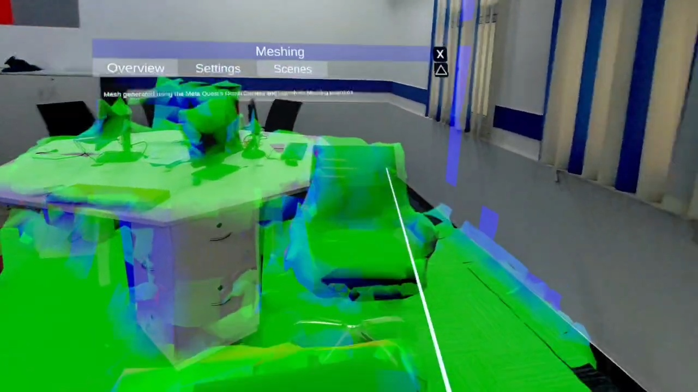

# Niantic Spatial SDK Segmentation for Meta Quest

<!-- SPACE FOR PHOTO -->

## About the Project
This project showcases real-time spatial awareness and segmentation for the Meta Quest using the **Niantic Lightship Spatial SDK**. Designed as a robust foundation for mixed reality (MR) experiences, it demonstrates how to leverage passthrough camera feeds, perform object segmentation, and seamlessly integrate virtual elements into the physical environment. 

## How to Run

### Option 1: Quick Install (Pre-built APK)
If you want to immediately try the application on your Meta Quest headset:
1. Ensure your Meta Quest headset is in **Developer Mode**.
2. Connect the headset to your computer via a USB-C cable.
3. Use a tool like [Meta Quest Developer Hub (MQDH)](https://developer.oculus.com/downloads/package/oculus-developer-hub-windows/)
4. Put on your headset, navigate to **App Library > Unknown Sources**, and launch the application.

### Option 2: Open in Unity (For Developers)
If you want to explore the source code, modify the project, or build it yourself:

**Prerequisites:**
- **Unity Hub** and **Unity Editor** (Use the version specified in the project, typically 2022.3 LTS).
- **Android Build Support** module installed in your Unity Editor.
- A Meta Quest headset with Developer Mode enabled.

**Steps:**
1. Clone or download this repository to your local machine.
2. Open **Unity Hub**, click **Open**, and select the `Niantic_SpatialSDK-main` directory.
3. Allow Unity some time to import the project assets and resolve the necessary packages.
4. Once opened, navigate to the `Assets/` folder in the Project window and open the main scene.
5. To build and deploy to your headset:
   - Go to **File > Build Settings**.
   - Make sure the build platform is set to **Android**.
   - Connect your headset to your PC.
   - Click **Build and Run** to compile the project and launch it directly on your Meta Quest.
